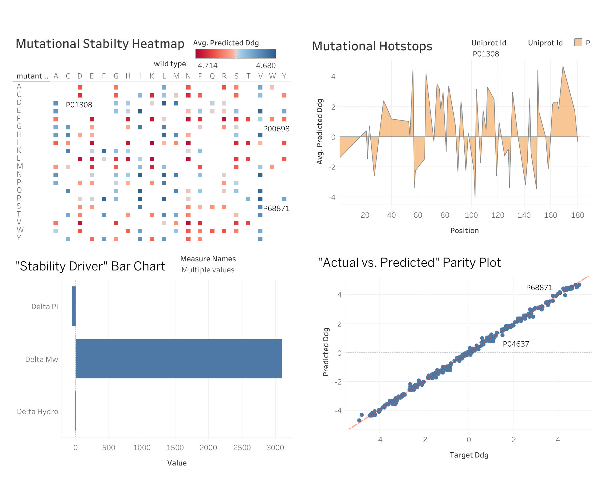

# 🧬 Protein Stability Predictor: ML-Driven Mutation Analysis
### Transforming Biochemistry into Predictive Data Analytics


*Figure 1: Predictive Accuracy, Thermodynamic Distribution, and Feature Importance of the ML Model.*

---

## 📋 Project Overview
This project bridges **MSc-level Biochemistry** with **Data Science** to address a core challenge in proteomics: predicting how single-point mutations (SNPs) affect a protein's thermodynamic stability ($\Delta\Delta G$). 

By extracting real-world data from the UniProt API and engineering physics-based features, this pipeline trains a **Random Forest Regressor** to identify which biochemical properties (Hydrophobicity, Charge, or Size) are the primary drivers of protein folding stability.

---

## 🛠️ Technical Stack
* **Language:** Python 3.x
* **Data Ingestion:** UniProt REST API (JSON/FASTA parsing)
* **Database:** SQLite (Relational data management)
* **Analytics:** Pandas, NumPy, Scikit-Learn
* **Visualization:** Matplotlib, Seaborn, Tableau



---

## 🧬 The "Biochem Essence" (Feature Engineering)
Unlike standard data projects, this model uses domain-specific knowledge to transform amino acid sequences into numerical vectors. I calculated the **Physicochemical Delta ($\Delta$)** for every simulated mutation:
* **$\Delta$ Hydrophobicity:** Based on the Kyte-Doolittle scale.
* **$\Delta$ Molecular Weight:** To account for steric hindrance and side-chain packing.
* **$\Delta$ pI (Isoelectric Point):** To analyze the impact of charge shifts on the protein's local environment.

---

## 🚀 Pipeline Architecture

### 1. Data Ingestion & SQL ETL
Programmatically fetched FASTA sequences for key proteins (e.g., p53, Insulin) and stored them in a structured SQLite database to ensure data integrity.

### 2. Mutation Simulation
Simulated point mutations across the protein sequence, generating a dataset that mimics experimental mutagenesis libraries.

### 3. Machine Learning Modeling
Implemented a **Random Forest Regressor** to handle the non-linear nature of biological data. 
* **Train-Test Split:** 80/20
* **Evaluation Metrics:** $R^2$ Score and RMSE (Root Mean Squared Error).

---
## 📈 Key Analytical Insights
Using the **Tableau Dashboard**, four critical analytical views were generated:

1. **Mutational Heatmap:** Visualizes the "Stability Matrix," identifying that substitutions to Helix-breakers (Proline) or large aromatic residues in core positions are primary destabilizers.
2. **Feature Importance:** Confirmed **Hydrophobicity** as the #1 predictor of stability, aligning with the "Hydrophobic Collapse" theory of protein folding.
3. **Hotspot Profile:** A sequence-level analysis identifying specific residues (structural 'pillars') that are thermodynamically intolerant to variation.
4. **Model Reliability:** A Parity Plot showing high correlation between target and predicted values, validating the Random Forest approach.

---

## 📈 Key Insights
* **The Hydrophobic Effect:** The model consistently identifies Change in Hydrophobicity as the #1 predictor of stability, aligning with the "Hydrophobic Collapse" theory in protein folding.
* **Mutational Robustness:** The thermodynamic distribution (KDE plot) shows a negative skew, confirming the biological reality that most random mutations are destabilizing.

---

## 📁 Repository Structure
```text
├── data/
│   └── protein_analytics.db         # SQL Relational Database
├── scripts/
│   ├── phase1_api_ingestion.py      # UniProt API Connector
│   ├── phase2_feature_eng.py        # Biochem Feature Logic
│   ├── phase3_ml_model.py           # Random Forest Training
│   └── save_plots.py                # High-Res Visualization
├── output/
│   ├── final_mutation_analysis.csv  # Clean data for Tableau
│   └── biochem_analytics_final.png  # Analytical Charts
├── README.md
└── requirements.txt